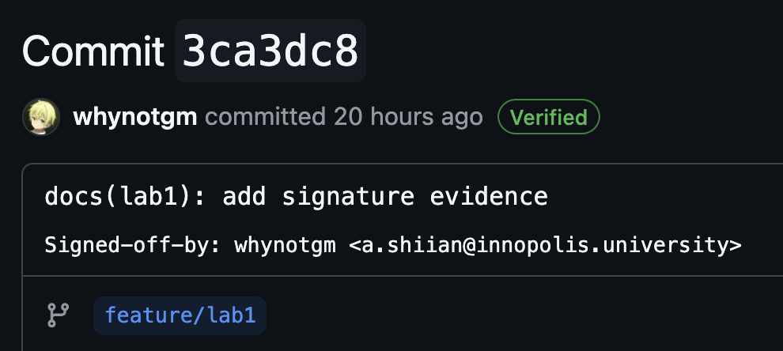
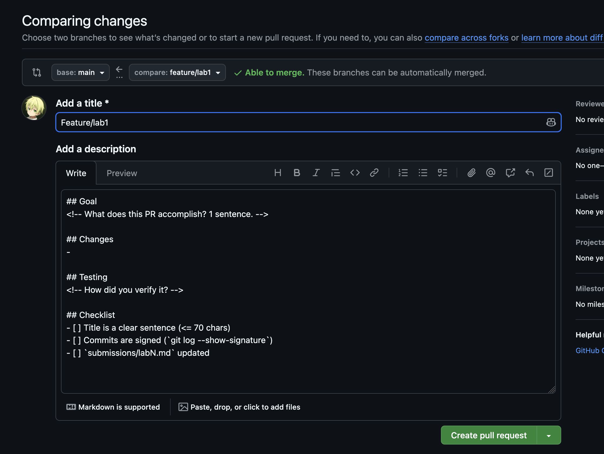
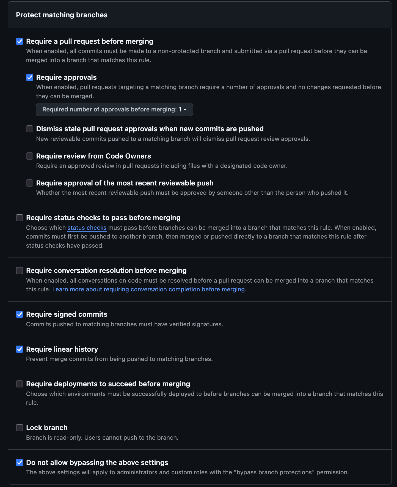

# Lab 1 Submission

## Task 1: SSH Commit Signing and QuickNotes Run

### QuickNotes Evidence

QuickNotes was run locally with a temporary data file:

```bash
ADDR=:18080 DATA_PATH=/tmp/quicknotes-lab1-notes.json SEED_PATH=seed.json go run .
```

Server startup output:

```text
2026/06/07 15:18:52 quicknotes listening on :18080 (notes loaded: 4)
```

Health check before creating a note:

```bash
curl -s http://localhost:18080/health | python3 -m json.tool
```

```json
{
    "notes": 4,
    "status": "ok"
}
```

List notes before creating a note:

```bash
curl -s http://localhost:18080/notes | python3 -m json.tool
```

```json
[
    {
        "id": 1,
        "title": "Welcome to QuickNotes",
        "body": "This is the project you'll containerize, deploy, monitor, and harden across all 10 labs.",
        "created_at": "2026-01-15T10:00:00Z"
    },
    {
        "id": 2,
        "title": "Read app/main.go first",
        "body": "Start by understanding the entry point \u2014 env vars, signal handling, graceful shutdown.",
        "created_at": "2026-01-15T10:05:00Z"
    },
    {
        "id": 3,
        "title": "DevOps mantra",
        "body": "If it hurts, do it more often.",
        "created_at": "2026-01-15T10:10:00Z"
    },
    {
        "id": 4,
        "title": "Endpoint cheat-sheet",
        "body": "GET /notes  GET /notes/{id}  POST /notes  DELETE /notes/{id}  GET /health  GET /metrics",
        "created_at": "2026-01-15T10:15:00Z"
    }
]
```

Create a new note:

```bash
curl -s -X POST http://localhost:18080/notes \
  -H 'Content-Type: application/json' \
  -d '{"title":"hello","body":"first POST"}' | python3 -m json.tool
```

```json
{
    "id": 5,
    "title": "hello",
    "body": "first POST",
    "created_at": "2026-06-07T12:19:25.436341Z"
}
```

Health check after creating a note:

```bash
curl -s http://localhost:18080/health | python3 -m json.tool
```

```json
{
    "notes": 5,
    "status": "ok"
}
```

### SSH Signing Evidence

Git signing configuration:

```text
gpg.format=ssh
user.signingkey=~/.ssh/inno-devops-signing.pub
commit.gpgsign=true
```

Signed commit verification:

```text
commit ad68bde7daef814e65d58f805ed180e72db0284d
Good "git" signature with ED25519 key SHA256:1+FN7gbX/oPuOkViQ3tkxMNih4MR/jJIPbeyF52zax8
No principal matched.
Author:     whynotgm <a.shiian@innopolis.university>
AuthorDate: Sun Jun 7 15:27:56 2026 +0300
Commit:     whynotgm <a.shiian@innopolis.university>
CommitDate: Sun Jun 7 15:27:56 2026 +0300

    docs(lab1): complete submission

    Signed-off-by: whynotgm <a.shiian@innopolis.university>
```

Verified badge screenshot:


### Why Signed Commits Matter

Signed commits give reviewers cryptographic evidence that a commit was created by the holder of a trusted key, which makes impersonation and silent history tampering easier to detect. The xz-utils backdoor disclosed in March 2024 showed how much damage can come from compromised trust in a software supply chain; signing is not a complete defense by itself, but it strengthens the audit trail and makes suspicious provenance stand out earlier during review.

## Task 2: Pull Request Template and First PR

Added the GitHub pull request template at:

```text
.github/pull_request_template.md
```

Template contents:

```markdown
## Goal
<!-- What does this PR accomplish? 1 sentence. -->

## Changes
- 

## Testing
<!-- How did you verify it? -->

## Checklist
- [ ] Title is a clear sentence (<= 70 chars)
- [ ] Commits are signed (`git log --show-signature`)
- [ ] `submissions/labN.md` updated
```

PR evidence:



## Bonus Task: Branch Protection

```
>>> DevOps-Intro % git push                                                        
Enumerating objects: 1, done.
Counting objects: 100% (1/1), done.
Writing objects: 100% (1/1), 197 bytes | 197.00 KiB/s, done.
Total 1 (delta 0), reused 0 (delta 0), pack-reused 0 (from 0)
remote: error: GH006: Protected branch update failed for refs/heads/main.
remote: 
remote: - Commits must have verified signatures.
remote:   Found 1 violation:
remote: 
remote:   45c1414e57f8e0677ec5e59591e80ceb80615c52
remote: 
remote: - Changes must be made through a pull request.
To https://github.com/whynotgm/DevOps-Intro
 ! [remote rejected] main -> main (protected branch hook declined)
error: failed to push some refs to 'https://github.com/whynotgm/DevOps-Intro'
```



Reflection:

If Knight Capital had required protected deployment branches, signed commits, pull requests, and linear history for production changes, it would have been harder for unreviewed or inconsistent code to reach production. Required signing would have improved accountability by tying deployable commits to trusted keys. Pull request gates would also have created a visible checkpoint for reviewers to catch incomplete rollout assumptions before they affected live trading systems. These controls do not replace testing or deployment automation, but they reduce the chance that one unchecked change becomes a production incident.
