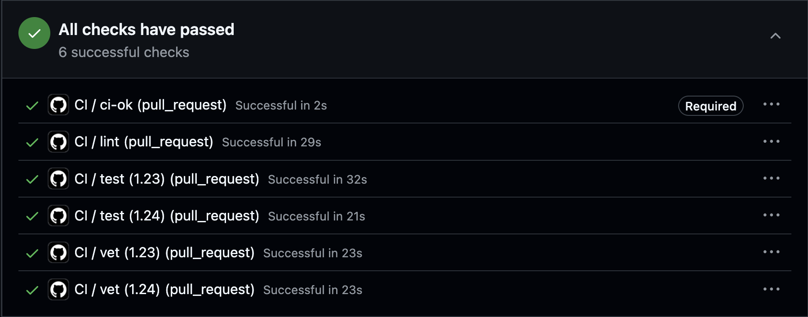
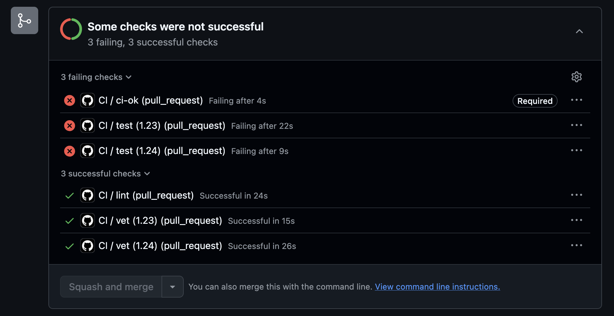
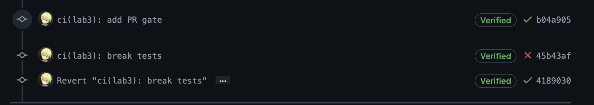
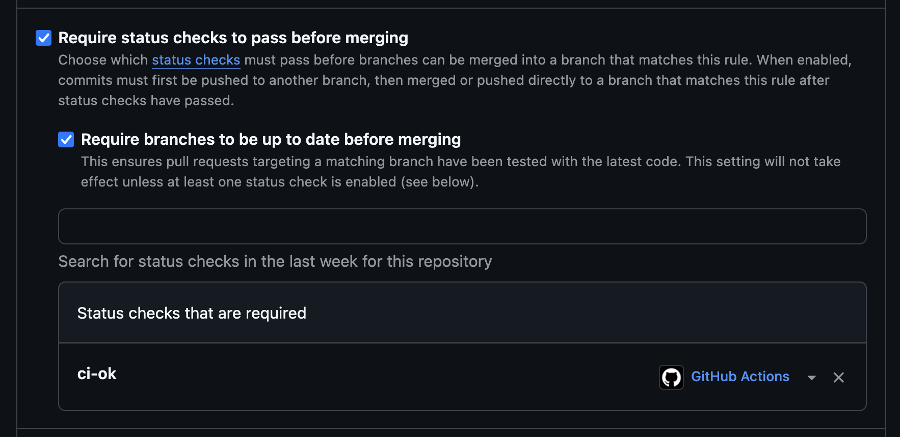

# Lab 3 Submission

## Path

I chose the GitHub Actions path because this fork is hosted on GitHub and GitHub Actions gives the most direct PR-gate integration for this course repository.

## CI Evidence

- Green CI run: 
- Deliberately failed run from Task 1.5: 
- Fix commit that restored green CI: .
- Branch protection evidence: 

## Pipeline Summary

- Workflow file: `.github/workflows/ci.yml`.
- Trigger: pushes to `main` and pull requests targeting `main`.
- Path filter: CI runs only when `app/**` or `.github/workflows/ci.yml` changes.
- Runtime: `ubuntu-24.04`, with Go `1.23` and `1.24` matrix cells for `vet` and `test`.
- Gate units:
  - `vet`: `go vet ./...`
  - `test`: `go test -race -count=1 ./...`
  - `lint`: `golangci-lint run`, pinned to `v2.5.0`
- Aggregation check: `ci-ok`; this is the single required status check for branch protection.
- Cache: `actions/setup-go` cache enabled and keyed by `app/go.mod`. QuickNotes has no `go.sum` because it has no third-party module dependencies.

## Task 1 Design Questions

### a) Why pin `ubuntu-24.04` instead of `ubuntu-latest`?

`ubuntu-latest` is a moving alias. GitHub can repoint it to a newer image, which can change installed packages, compilers, shells, OpenSSL behavior, or preinstalled tools without a repository change. Pinning `ubuntu-24.04` makes CI failures correlate with our commits instead of a platform image migration.

### b) Why split vet, test, and lint into separate units?

Separate jobs run in parallel and report the failing class of problem directly. A combined job is simpler, but it serializes unrelated work and stops at the first failure, so a lint failure could hide a test failure until the next run.

### c) What real attack does SHA pinning prevent?

SHA pinning prevents tag-retargeting attacks against actions. Lecture 3 cites the March 2025 compromise of `tj-actions/changed-files`, where the attacker rewrote tags to malicious code and leaked secrets from public CI logs. A full commit SHA is immutable in the normal Git object model, so `v4` or `v4.2.2` moving does not change what the workflow executes.

### d) What is `permissions:` and what principle is behind it?

`permissions:` sets the default `GITHUB_TOKEN` scopes for the workflow or job. This workflow uses `contents: read`, following least privilege: CI needs to read the repository, not write issues, packages, deployments, or pull requests.

### e) GitLab-only question

I used the GitHub path, so this does not apply to my implementation. In GitLab, a stage is an ordering group and a job is a concrete unit of work inside a stage. `stages:` controls execution order; `dependencies:` controls which previous job artifacts are downloaded by a job.

## Task 2 Timing Table

| Scenario | Wall-clock |
|----------|-----------:|
| Baseline: no cache, single Go version, no path filter | 35s |
| With cache | 36s |
| With cache + matrix | 38s |

QuickNotes has no third-party dependencies, so caching doesn't affect total wall-clock time. The dominant cost is runner provisioning, checkout, setup, and linter download rather than module download. Time with matrix was increased a little due to parallel job management overhead.

## Task 2 Optimizations

- Enabled the Go cache through `actions/setup-go` so module and build caches are restored from a dependency-file key.
- Added a matrix for `vet` and `test` across Go `1.23` and `1.24`.
- Set `fail-fast: false` so all matrix cells report even if one version fails.
- Added path filters so docs-only changes outside `app/` do not start the workflow.
- Added `ci-ok` as a stable required check, avoiding branch-protection churn when matrix labels change.

## Task 2 Design Questions

### f) Why cache `go.sum`-keyed inputs and not build outputs?

Dependency inputs are deterministic: if the module lock data is unchanged, restoring those dependencies is safe and repeatable. Build outputs are more environment-sensitive because they can encode architecture, compiler version, build flags, CGO settings, or stale generated state. For this repo there is no `go.sum`, so the workflow keys the cache on `app/go.mod`; if dependencies are added later, the cache key should include `app/go.sum`.

### g) What does `fail-fast: false` change in a matrix run?

With `fail-fast: false`, one failing matrix cell does not cancel the remaining cells. That is useful for compatibility checks because I want to know whether only Go `1.23` failed or both versions failed. I would use `fail-fast: true` for expensive jobs where the first failure already proves the PR cannot merge and extra cells are unlikely to add useful diagnosis.

### h) What is the cache poisoning risk?

The risk is that untrusted PR code writes malicious files into a cache, then a trusted workflow later restores and executes those files. GitHub mitigates this with cache scope restrictions: caches created by pull-request runs are scoped to the PR merge ref and cannot be restored by the base branch or other pull requests. The relevant GitHub reference is "Dependency caching reference", especially the cache access restrictions section: https://docs.github.com/en/actions/reference/workflows-and-actions/dependency-caching
